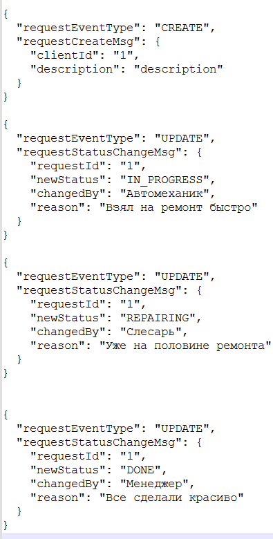
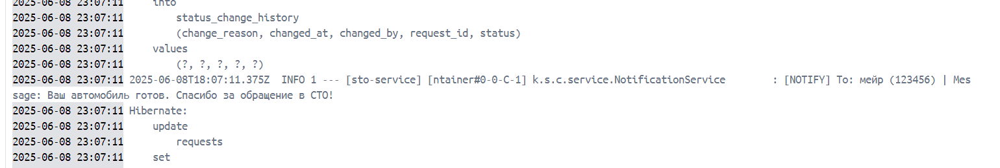

## Как запустить проект

### 1. Клонируем репозиторий

```bash
git clone https://github.com/sttmeir/technical-task.git
cd technical-task
```
### 2. Запускаем контейнеры через Docker Compose
```bash
docker-compose up
```

### 3. Доступ к приложению
Основной сервис: http://localhost:8080

Swagger-документация: http://localhost:8080/swagger-ui/index.html#/

### 4. Тест приложения
#### 1. Создаем клиента: http://localhost:8080/swagger-ui/index.html#/%D0%9A%D0%BB%D0%B8%D0%B5%D0%BD%D1%82%D1%8B/create
#### 2. Чтобы создать заявку нужно создать кафка события на создание заявки. Для этого на командной строке запускаем продюсер
```bash
docker exec -it kafka kafka-console-producer --broker-list localhost:9092 --topic request-events
```

В командную строку по очереди кладем кафка события:
1. {"requestEventType":"CREATE","requestCreateMsg": {"clientId":"1","description":"description"}}
2. {"requestEventType":"UPDATE","requestStatusChangeMsg": {"requestId":"1","newStatus":"IN_PROGRESS","changedBy":"Автомеханик","reason":"Взял на ремонт"}}
3. {"requestEventType":"UPDATE","requestStatusChangeMsg": {"requestId":"1","newStatus":"REPAIRING","changedBy":"Слесарь","reason":"Уже на половине ремонта"}}
4. {"requestEventType":"UPDATE","requestStatusChangeMsg": {"requestId":"1","newStatus":"DONE","changedBy":"Менеджер","reason":"Все сделали красиво"}}

Структура выглядит следующим образом:



#### 3. Проверяем созданные заявки: 
1. Получить все запросы: http://localhost:8080/swagger-ui/index.html#/%D0%97%D0%B0%D1%8F%D0%B2%D0%BA%D0%B8/getAllRequests
2. Получить запросы по статусу: http://localhost:8080/swagger-ui/index.html#/%D0%97%D0%B0%D1%8F%D0%B2%D0%BA%D0%B8/getRequestsByStatus
3. Получить запросы по клиенту: http://localhost:8080/swagger-ui/index.html#/%D0%97%D0%B0%D1%8F%D0%B2%D0%BA%D0%B8/getRequestsByClient

#### 4. После каждого кафка события проверяем логи:


### 5. Остановка контейнеров
```bash
docker-compose down
```
### 6. Примечания
1. В целях упрощения проекта и снижения сложности, контроллеры возвращают сущности напрямую вместо использования DTO (Data Transfer Object). 
2. Kafka Producer принимает по одному сообщению. Не вставляйте сразу массив JSON.
3. Перед отправкой события CREATE убедитесь, что клиент с таким clientId существует в базе.
